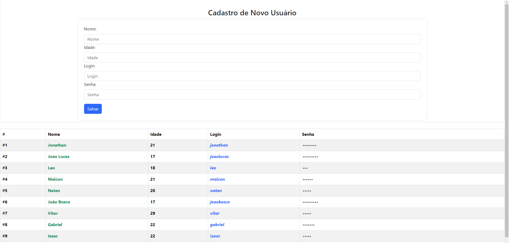

## MVC Usuário

* Projeto realizando CRUD de usuário, utilizando Express para manipular as requisições no Back-end.


### Como rodar
1. Para rodar o projeto, certifique-se de ter o <a href="https://nodejs.org/en">Node.js</a> instalado em sua maquina.
    > Projeto desenvolvido na versão 18.16.0 do Node.js

2. Abra o terminal raiz do diretório, em seguida mude o caminho para o "BACKEND":

    ```
    cd BACKEND
    ```
3. Instale as depencencias do projeto ainda na basta "BACKEND":
    ```
    npm i
    ```
4. Suba o servidor:
    ```
    npm start
    ```
5. Agora basta abrir o arquivo index.html na pasta raiz do diretório.

### Preview

<table width="100%">
<tr width="100%">
<td>

</td>
</tr>
</table>